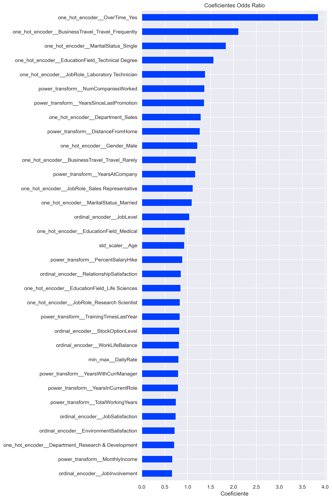

# IBM Employee Attrition Prediction
Uma aplicação de aprendizado de máquina para prever a rotatividade de funcionários utilizando o conjunto de dados IBM HR Analytics. Disponível no [Kaggle](https://www.kaggle.com/datasets/pavansubhasht/ibm-hr-analytics-attrition-dataset/data).

## Interação com o aplicativo web
O aplicativo web foi feito com [Streamlit](https://streamlit.io)

## Orientações a respeito do projeto
##### Dentro da pasta `referencias` possue 3 arquivos:
- `01_sobre_a_base.md:` Arquivo com todos os detalhes a respeito da base de dados.
- `02_dicionario_de_dados.md:` Arquivo com todos os detalhes a respeito das colunas da base e seus tipos.
- `03_organização_do_projeto.md` Arquivo com orientações a respeito da organização das pastas e arquivos do projeto.

## Conversão dos coeficientes para Odds Ratio

Após analisar os coeficientes da Regressão Logística, foi convertido de **Logg-Odds** para **Odds Ratio**, tornando sua interpretação mais intuitiva.

### Por que fazer essa conversão?

Os coeficientes da Regressão Logística são calculados na escala de **log-odds**, o que dificulta sua interpretação direta.

Ao aplicar o `exponencial dos coeficientes`, os coeficientes passam a representar o **Odds Ratio**, indicando quanto as chances de ocorrência do evento aumentam ou diminuem.

- **Coeficientes > 1:** Aumenta as chances do evento.
- **Coeficientes = 1:** Não afeta as chances.
- **Coeficientes < 1:** Diminui as chances do evento ocorrer.

### Objetivo

A conversão para **Odds Ratio** facilita a interpretação dos resultados, permitindo entender de forma mais clara o impacto de cada variável na probabilidade de ocorrência do evento estudado.
Como resultado tivemos o coeficiente `OverTime` como maior impacto no evento estudado.

O gráfico acima foi feito com a função `plot_coeficientes` que está em `notebooks/src/graficos`

## O que foi desenvolvido neste projeto?

### 1. Análise Exploratória dos Dados (EDA)

Nesta etapa foi realizada uma análise completa do conjunto de dados para compreender suas características e preparar as informações para a modelagem.

As principais atividades foram:

* Análise das variáveis e seus respectivos tipos de dados.
* Remoção de colunas que não agregavam valor ao modelo.
* Identificação do desbalanceamento da variável alvo (*Attrition*).
* Separação das variáveis categóricas (ordenadas e não ordenadas) e numéricas.
* Utilização de *list comprehension* para seleção automática das colunas numéricas.
* Construção de histogramas para analisar a distribuição das variáveis numéricas.
* Criação de boxplots para identificação de dispersão e possíveis outliers.
* Comparação das variáveis numéricas em relação à variável alvo por meio de boxplots.
* Geração de um mapa de calor (*heatmap*) para analisar a correlação entre as variáveis.

---

### 2. Pré-processamento e Modelagem

Após a análise exploratória, foi construída uma pipeline completa de preparação dos dados para treinamento dos modelos.

As principais etapas incluíram:

* Separação das variáveis preditoras (**X**) e da variável alvo (**y**).
* Codificação da variável alvo utilizando **LabelEncoder**.
* Aplicação de **MinMaxScaler** para normalização das variáveis numéricas.
* Aplicação do **PowerTransformer** para aproximar determinadas distribuições de uma curva normal.
* Construção de pipelines de pré-processamento para diferentes algoritmos.
* Utilização de **K-Fold Cross Validation** para uma avaliação mais robusta dos modelos.
* Cálculo da proporção entre as classes para lidar com o desbalanceamento da variável alvo.
* Treinamento e comparação de diferentes algoritmos de Machine Learning.
* Organização automática dos resultados em um DataFrame para facilitar a comparação entre os modelos.

---

### 3. Seleção e Otimização do Modelo

Os modelos foram comparados utilizando métricas de classificação, priorizando o desempenho em um cenário com classes desbalanceadas.

As principais decisões foram:

* Comparação dos modelos utilizando a métrica **AUPRC (Área sob a Curva Precision-Recall)**.
* Utilização do **Recall** como critério de desempate entre modelos com desempenho semelhante.
* Seleção da **Regressão Logística (Logistic Regression)** como modelo final.
* Otimização dos hiperparâmetros com **GridSearchCV**, buscando automaticamente a melhor combinação de parâmetros.

---

### 4. Interpretabilidade do Modelo

Além do desempenho, foi realizada uma análise da influência de cada variável na decisão do modelo.

Para isso:

* Os coeficientes do modelo foram transformados em um DataFrame.
* Foi criado um gráfico para visualizar a importância das variáveis.
* A interpretação dos coeficientes permitiu identificar:

  * **Coeficientes positivos:** aumentam a probabilidade de desligamento do funcionário.
  * **Coeficientes negativos:** reduzem essa probabilidade.
  * **Quanto maior o valor absoluto do coeficiente, maior a influência da variável na previsão do modelo.**

Essa etapa tornou o modelo mais interpretável, permitindo compreender quais fatores exercem maior impacto na previsão de atrito dos colaboradores.

## Considerações finais
Este projeto foi desenvolvido durante a formação em Ciência de Dados da [HashtagTreinamentos](https://www.hashtagtreinamentos.com/) e conduzido pelo professor [Francisco Bustamente](https://www.linkedin.com/in/flsbustamante/). 

 Ao longo do desenvolvimento, foram aplicados diversos conceitos fundamentais de Ciência de Dados e Machine Learning, incluindo análise exploratória de dados, pré-processamento, construção e avaliação de modelos, otimização de hiperparâmetros e interpretação dos dos resultados. 

 O projeto teve caráter didático, servindo como uma oportunidade para consolidar os conhecimentos adquiridos durante a formação e colocá-los em prática.